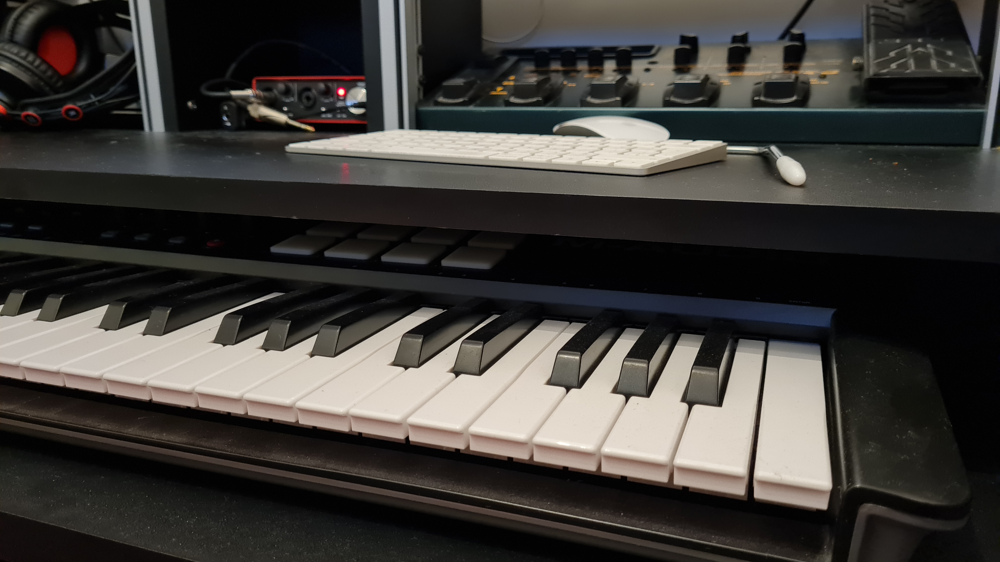

OK onto electronica instrumentals (and other weird things). When the flow takes ya, you just gotta go with it!

    

  
<head>
<meta charset="UTF-8">
<title>Audio Player with a playlist | Able Player Demos</title>
<link rel="stylesheet" href="demos.css" type="text/css">

<!-- Dependencies -->

<!-- Able Player CSS -->
<link rel="stylesheet" href="./build/ableplayer.min.css" type="text/css"/>

<!-- Able Player JavaScript -->

</head>

<body>
		<!--<header>
		
Able Player Demos

	</header> 
	<nav>
		<ul>
			<li><a href="index.html">More demos</a></li>
			<li><a href="https://ableplayer.github.io/ableplayer">Able Player Home</a></li>
		</ul>
	</nav> -->
	<main>
		<h1>Concoction EP</h1>

		<!-- use the following markup for each media element -->
		<audio id="audio1" width="480" preload="auto" data-able-player data-skin="2020" loop>
			<!-- source elements are optional when there's a playlist. -->
			<!-- If ommitted, they will be constructed from the first playlist item -->
		</audio>

		<!-- use the following markup for each playlist -->
		<!-- an AblePlayer playlist is any <ul> with class="able-playlist" -->
		<!-- The value of data-player must match the id of the media element -->
		<!-- Add data-embedded to embed the playlist into the media player -->
		<!-- see documentation for additional details about markup -->
		<ul class="able-playlist" data-player="audio1" data-embedded>
			<li data-poster="./images/Feel Good-2.png">
				
				<button>Concoction</button>
			</li>
			<li>
				
				<button>Floodlit Couch</button>
			</li>
			<li>
				
				<button lang="fr">Magnetic</button>
			</li>
			<li>
				
				<button>Timelapse Bubo</button>
			</li>
			<li>
				
				<button>Wobbler</button>
			</li>
      <li>
				
				<button>Vacuum</button>
			</li>
		</ul>
	</main>
</body>

